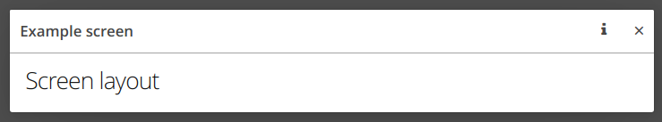
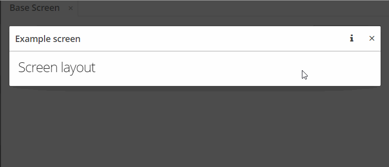

<p>
    <a href="http://www.apache.org/licenses/LICENSE-2.0"></a>
</p>

## HeaderButton add-on

This add-on based on the [CUBA framework](https://www.cuba-platform.com)
and provides functionality to add buttons to the header of the dialog screen.
The demo project of this add-on you can find here: [flaurite/headerbutton-demo](https://github.com/Flaurite/headerbutton-demo). 

### Compatibility

| Framework Version| Add-on version |
| -----------------|----------------|
| 7.2.5            | 0.1-SNAPSHOT   |

### Installation by coordinates
Firstly you should install this add-on to your local maven repository:
1. Download add-on
2. Navigate to the project dir and run the following command:
```shell script
./gradlew install
``` 

After that you will be able to add `headerbutton` add-on to the project:

1. Open your application in CUBA Studio. Check the latest version of CUBA Studio on the [CUBA Platform site](https://www.cuba-platform.com/download/previous-studio/).
2. Go to _CUBA -> Marketplace_ in the main menu.
3. Click the icon in the upper-right corner.

4. Paste the add-on coordinates in the corresponding field as follows:
```
com.flaurite.addon.headerbutton:headerbutton-global:<add-on version>
```
Click Install and apply the changes. The add-on will be installed to your project.

### Usage

The base functionality concluded in the facet: `HeaderButtonFacet`,
so it is possible to use a declarative way to define header buttons.

Add the following schema to your dialog screen:
```
xmlns:hb="http://schemas.headerbutton/headerbutton/0.1/headerbutton.xsd"
```
Then add `headerButtons` facet:
```xml
<facets>
    <hb:headerButtons id="headerButtons">
        <hb:button id="infoBtn"
                   icon="INFO"/>
    </hb:headerButtons>
</facets>
```
If you launch the application in the open dialog screen, you will see the following:


Now we can add a click listener to the "Info" button. For this, we can use the "Subscription" API.
In the dialog screen controller, add the following code:
```
@Subscribe("headerButtons.infoBtn")
private void onCaptionBtnClickEvent(HeaderButton.ButtonClickEvent event) {
    notifications.create(Notifications.NotificationType.TRAY)
            .withCaption("Info button is clicked")
            .withDescription(event.getButtonId())
            .show();
}
```
Result:


